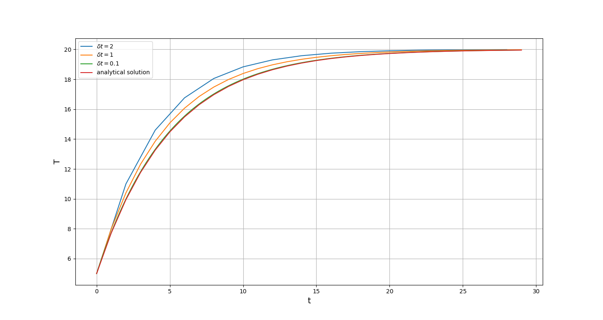

# Code for numerical solution and analytical solution of ODE.
Get the numerical solution by Euler Method：


Code for Euler Method:

```python
num_solution_1 = []
for i in range(30):
    if i == 0:
        T1 = 5
        t = T1
        num_solution_1.append(T1)
    else:
        dT1 = 0.2*(20 - t)
        T1 = T1 + i*dT1
        t = T1
        num_solution_1.append(T1)
       
```

And then get the analytical solution by method of variation of constant:
$$
T = -15e^{-0.2x}+20
$$
And pictured the image of  numerical solutions(color blue and orange) and analytical solution(color green):

