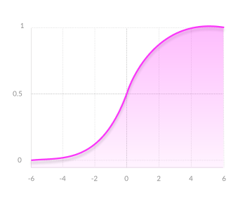

# 1. Code for numerical solution and analytical solution of ODE.
Get the numerical solution by Euler Method：


Code for Euler Method:

```python
num_solution_1 = []
for i in range(30):
    if i == 0:
        T1 = 5
        t = T1
        num_solution_1.append(T1)
    else:
        dT1 = 0.2*(20 - t)
        T1 = T1 + dT1
        t = T1
        num_solution_1.append(T1)
       
```

And then get the analytical solution by method of variation of constant:
$$
T = -15e^{-0.2x}+20
$$
And pictured the image of  numerical solutions(color blue, orange and green) and analytical solution(color red):


# 2. Code for Handwritten recognition
## Answer for basic questions:
* How to build DNN using Tensoflow?

  Answer:

  ```python
  # Design model
  model = tf.keras.models.Sequential([tf.keras.layers.Flatten(),
                                    tf.keras.layers.Dense(128, activation=tf.nn.relu),
                                    tf.keras.layers.Dense(10, activation=tf.nn.softmax)])
  # Compiling Loss function and Optimizer
  model.compile(optimizer = tf.keras.optimizers.Adam(),
               loss = 'sparse_categorical_crossentropy',
               metrics = ['accuracy'])
  model.fit(training_sets, training_labels, epochs=5)
  ```

  

* What is activation functions, how to choose them?

  Answer: Activation functions are mathematical equations that determine the output of a neural network.

  There 7 common Nonlinear Activation Functions:

  ## Sigmoid / Logistic:

  #### 

  ###### Advantages

  * **Smooth gradient**, preventing 'jumps' in output values.
  * **Output values bound** between 0 and 1, normalizing the output of each neuron.
  * **Clear predictions** ---For X above 2 or below -2, tends to bring the Y value (the prediction) to the edge of the curve, very close to 1 or 0. This enables clear predictions.

  ###### Disadvantages

  - **Vanishing gradient**—for very high or very low values of X, there is almost no change to the prediction, causing a vanishing gradient problem. This can result in the network refusing to learn further, or being too slow to reach an accurate prediction.

  - **Outputs not zero centered**.

  - **Computationally expensive**

    

  ## Sigmoid / Logistic:

  

###### Advantages

- **Zero centered**—making it easier to model inputs that have strongly negative, neutral, and strongly positive values.
- Otherwise like the Sigmoid function.

###### Disadvantages

- Like the Sigmoid function


## ReLU (Rectified Linear Unit)


###### Advantages

- **Computationally efficient**—allows the network to converge very quickly
- **Non-linear—**although it looks like a linear function, ReLU has a derivative function and allows for backpropagation

###### Disadvantages

- **The Dying ReLU problem**—when inputs approach zero, or are negative, the gradient of the function becomes zero, the network cannot perform backpropagation and cannot learn.


## Leaky ReLU


###### Advantages

- **Prevents dying ReLU problem**—this variation of ReLU has a small positive slope in the negative area, so it does enable backpropagation, even for negative input values
- Otherwise like ReLU

###### Disadvantages

- **Results not consistent**—leaky ReLU does not provide consistent predictions for negative input values.


## Parametric ReLU


###### Advantages

- **Allows the negative slope to be learned**—unlike leaky ReLU, this function provides the slope of the negative part of the function as an argument. It is, therefore, possible to perform backpropagation and learn the most appropriate value of α.
- Otherwise like ReLU

###### Disadvantages

- **May perform differently** for different problems.


## Softmax


###### Advantages

- **Able to handle multiple classes** only one class in other activation functions—normalizes the outputs for each class between 0 and 1, and divides by their sum, giving the probability of the input value being in a specific class.
- **Useful for output neurons**—typically Softmax is used only for the output layer, for neural networks that need to classify inputs into multiple categories.


## Swish


Swish is a new, self-gated activation function discovered by researchers at Google. According to their [paper](https://arxiv.org/abs/1710.05941v1), it performs better than ReLU with a similar level of computational efficiency. In experiments on ImageNet with identical models running ReLU and Swish, the new function achieved top -1 classification accuracy 0.6-0.9% higher.

#### [references](https://missinglink.ai/guides/neural-network-concepts/7-types-neural-network-activation-functions-right/)
